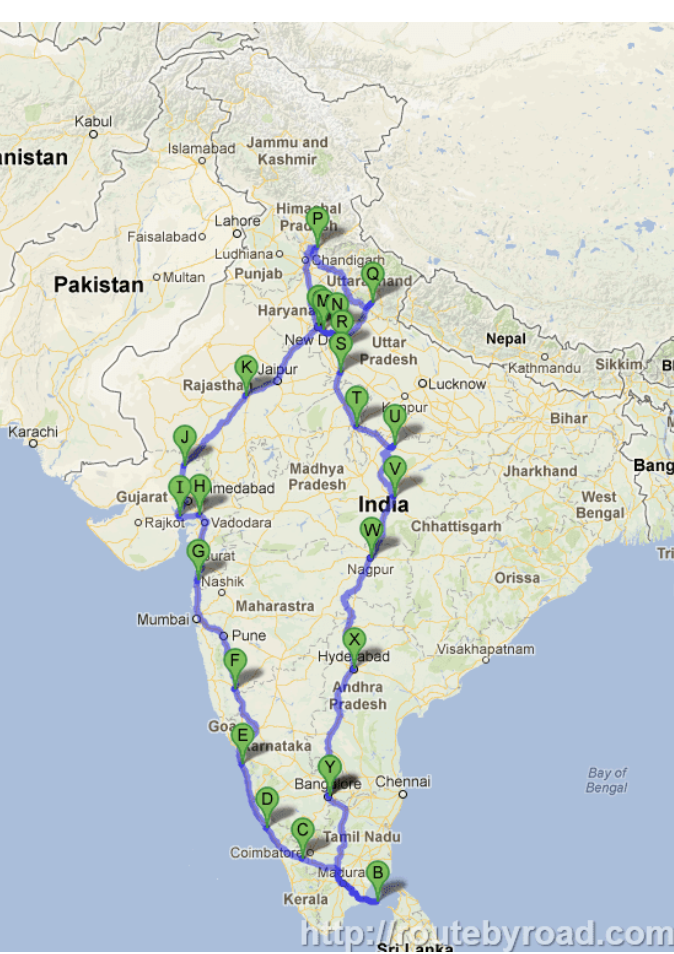

# Indian Multi-Modal Transportation System

An AI-powered multi-modal transportation system for intelligent travel decisions in Indian cities, focusing on comprehensive route comparison and user-centric design.



## Project Overview

This application helps users find the best transportation options between major Indian cities. Our intelligent system compares multiple modes of transportation including trains, flights, buses, and taxis based on various factors:

- 💰 **Cost efficiency** - Find the most economical options
- ⏱️ **Time savings** - Identify the fastest routes  
- 🛋️ **Comfort level** - Choose the most comfortable journey
- 📏 **Distance information** - Get accurate distance measurements

## Core Technologies

- **Frontend**: React with TypeScript
- **Backend**: Express.js server
- **Database**: PostgreSQL for data persistence
- **Geospatial Integration**: Custom maps of India
- **Authentication**: User accounts with secure session management
- **Email Notifications**: Route confirmation emails

## Features

### 🔍 Intelligent Route Comparison
- Compare multiple transportation modes
- View detailed cost breakdowns
- See accurate travel durations
- Get precise distance information

### 🗺️ Interactive Map Visualization
- Visualize routes on a map of India
- See detailed city-to-city connections
- Compare route distances visually
- Explore multi-city travel options

### 💌 Trip Confirmation Services
- Receive email confirmations
- Get detailed booking instructions
- Save itineraries for future reference
- Share travel plans with others

## Demo Version

A simplified demo of this application is available using Streamlit. The demo showcases the core functionality of route planning between Indian cities.

To run the demo:
```
python -m streamlit run streamlit_app.py
```

## Full Application

The full application provides a complete experience with real-time data, user authentication, and advanced route planning capabilities.

To run the full application:
```
npm run dev
```

## Deployment

The application can be deployed in two ways:

1. **Node.js Application**: Deploy as a standard Node.js application with React frontend
2. **Streamlit Demo**: Deploy the simplified Streamlit demo for quick access to core features

## Contact

For questions or support, contact us at: support@indiantransport.ai